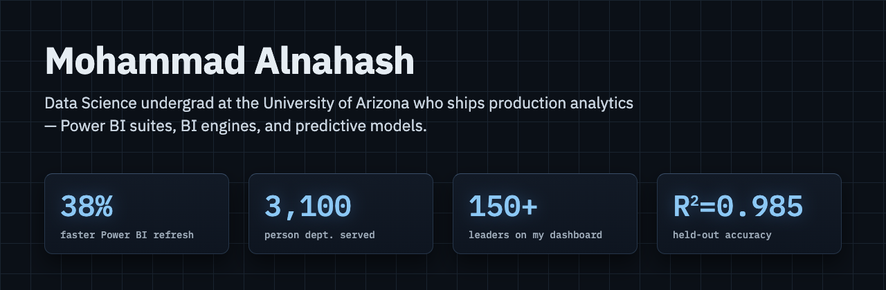

**Data Science & Digital Transformation Intern @ Saudi Aramco** (Summer 2026) · B.S. Data Science, University of Arizona — expected May 2027, minors in AI and Computer Science

🌐 **[malnahash.github.io](https://malnahash.github.io)** — full portfolio

## In production — Saudi Aramco

Three interconnected workforce platforms I architected, built, and deployed as a department's daily operational system of record. Zero infrastructure — self-contained HTML/JS applications with live multi-user sync over the SharePoint REST API. Internal to the Aramco intranet, so no public links.

| Platform | What it does |
|---|---|
| **CCSD Control Center** | Suite architecture: live multi-user read/write with check-out semantics, record-level merge, client-side Excel ingestion, identity resolution across three source systems |
| **Workforce Intelligence** | Assignments, leave, position-level coverage and succession — live, with a local natural-language query assistant |
| **Safety Matrix** | Certification compliance that escalates itself: statistically inferred course rules and an idempotent supervisor → manager → director notification ladder |
| **PDP Development Tracker** | Professional Development Programme end to end, including a fully automated Excel orientation workflow with sign-off dispatch and signature ingestion |

## Independent work

| Project | What it is |
|---|---|
| **Moneyball in Soccer** | Market value modeled for 17,000+ players; joint regression at R² = 0.985 on held-out data, cross-validated against four position-specific models |
| **LLM Benchmarks vs. Real-World Success** | 4,576 HuggingFace models merged with LMArena Elo; 7 methods under 10-fold CV — human preference partially predictable (CV R² = 0.55), popularity not |
| **VINRecordHub** | Founder — vehicle-history report platform: vehicle-data APIs, payments, automated delivery. Supabase · PayPal · Resend · Vercel |
| **xG reliability** | Expected-goals calibration on 900+ StatsBomb shots — permutation tests, bootstrap CIs, Monte Carlo shot-volume simulation |

## Skills

`Python` `SQL` `R` `JavaScript` `C++` `C#` — pandas, scikit-learn, statsmodels · Power BI, Power Query, ETL · SharePoint REST API, client-side XLSX · UiPath, RPA, Azure OpenAI

## Contact

📫 [nahash@arizona.edu](mailto:nahash@arizona.edu) · [Portfolio](https://malnahash.github.io) <!-- TODO: add LinkedIn link -->
